# Arbres rouge-noire (ARN)

Les arbres équilibrés sont des ABR pour lesquels $`h = \Theta(n)`$. Parmi les différents types d'arbres équilibrés on va s'intéresser aux ARN où chaque nœud possède une couleur.

## Définitions et propriétés

Pour simplifier les définitions et les algorithmes qui suivent, on va considérer les `null` comme des feuilles externes qu'on notera par ☒. Ainsi chaque nœud interne a deux fils.

**Définition** Un ARN est un ABR tel que :
  1. Chaque nœud est soit rouge, soit noir.
  2. La racine est noire.
  3. Les feuilles ☒ sont noires
  4. Si un nœud est rouge, alors ses deux fils sont noirs.
  5. Pour chaque nœud, tous les chemins le reliant à des feuilles contiennent le même nombre de nœuds noirs.

À partir de (4) et (5) on voit déjà que l'arbre est « équilibré » dans le sens où pour chaque sous-arbre, la branche la plus longue est au plus deux fois plus longue que la branche la plus courte.

**Définition** La hauteur noire d'un nœud $`x`$ (on note $`hn(x)`$) est le nombre de nœuds noirs (sans compter $`x`$) sur le chemin de $`x`$ vers une feuille. La hauteur noire d'un arbre est la hauteur noire de sa racine.

**Exemple**

```mermaid
graph TD
  50((50)) --- 32 & 80
  32((32)) --- 26 & 40
  80((80)) --- 58 & 92
  26((26)) --- 18 & 30
  40((40)) --- 36 & 44
  58((58)) --- 54 & 74
  92((92)) --- s01[ ] & s02[ ]
  18((18)) --- 12 & 22
  30((30)) --- 28 & s03[ ]
  36((36)) --- s04[ ] & 38
  44((44)) --- s05[ ] & s06[ ]
  54((54)) --- s07[ ] & s08[ ]
  74((74)) --- 68 & 76
  12((12)) --- 4 & s09[ ]
  22((22)) --- s10[ ] & s11[ ]
  28((28)) --- s12[ ] & s13[ ]
  38((38)) --- s14[ ] & s15[ ]
  68((68)) --- s16[ ] & s17[ ]
  76((76)) --- s18[ ] & s19[ ]
  4((4)) --- s20[ ] & s21[ ]


  classDef black fill:#000, stroke:#fff;
  classDef red fill:#f00, stroke:#fff;
  class 50,80,26,40,92,30,36,44,54,74,s01,s02,12,22,s03,s04,s05,s06,s07,s08,s09,s10,s11,s12,s13,s14,s15,s16,s17,s18,s19,s20,s21 black;
  class 32,58,18,28,38,68,76,4 red;
```

