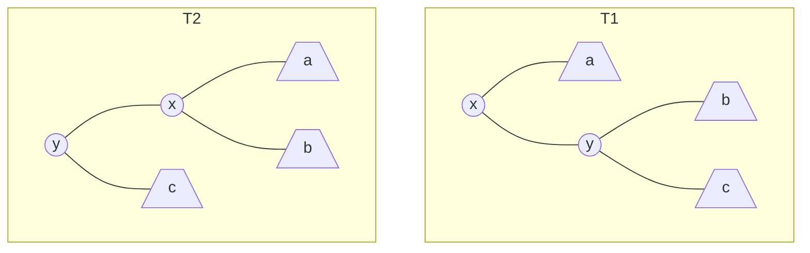
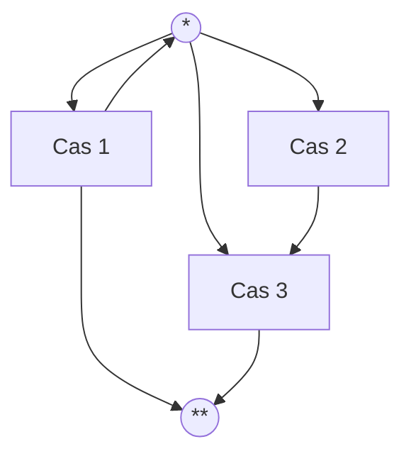

# Arbres rouge-noire (ARN)

Les arbres équilibrés sont des ABR pour lesquels $`h = O(\log n)`$. Parmi les différents types d'arbres équilibrés on va s'intéresser aux ARN où chaque nœud possède une couleur.

## Définitions et propriétés

Pour simplifier les définitions et les algorithmes qui suivent, on va considérer les `null` comme des feuilles externes qu'on notera par ☒. Ainsi chaque nœud interne a deux fils.

---

**Définition** Un *arbre rouge-noir (ARN)* est un ABR tel que :
  1. Chaque nœud est soit rouge, soit noir.
  2. La racine est noire.
  3. Les feuilles ☒ sont noires.
  4. Si un nœud est rouge, alors ses deux fils sont noirs.
  5. Pour chaque nœud, tous les chemins le reliant à des feuilles contiennent le même nombre de nœuds noirs.

À partir de (4) et (5) on voit déjà que l'arbre est « équilibré » dans le sens où pour chaque sous-arbre, la branche la plus longue est au plus deux fois plus longue que la branche la plus courte.

---

**Définition** La *hauteur noire* d'un nœud $`x`$ (on note $`hn(x)`$) est le nombre de nœuds noirs (sans compter $`x`$) sur le chemin de $`x`$ vers une feuille. La hauteur noire d'un arbre est la hauteur noire de sa racine.

---

**Exemple**

```mermaid
graph TD
  50((50)) --- 32 & 80
  32((32)) --- 26 & 40
  80((80)) --- 58 & 92
  26((26)) --- 18 & 30
  40((40)) --- 36 & 44
  58((58)) --- 54 & 74
  92((92)) --- s01[ ] & s02[ ]
  18((18)) --- 12 & 22
  30((30)) --- 28 & s03[ ]
  36((36)) --- s04[ ] & 38
  44((44)) --- s05[ ] & s06[ ]
  54((54)) --- s07[ ] & s08[ ]
  74((74)) --- 68 & 76
  12((12)) --- 4 & s09[ ]
  22((22)) --- s10[ ] & s11[ ]
  28((28)) --- s12[ ] & s13[ ]
  38((38)) --- s14[ ] & s15[ ]
  68((68)) --- s16[ ] & s17[ ]
  76((76)) --- s18[ ] & s19[ ]
  4((4)) --- s20[ ] & s21[ ]


  classDef black fill:#000, stroke:#fff;
  classDef red fill:#f00, stroke:#fff;
  class 50,80,26,40,92,30,36,44,54,74,s01,s02,12,22,s03,s04,s05,s06,s07,s08,s09,s10,s11,s12,s13,s14,s15,s16,s17,s18,s19,s20,s21 black;
  class 32,58,18,28,38,68,76,4 red;
```



---

En plus d'attributs `cle`, `pere`, `gauche` et `droit` des nœuds d'un ABR, on ajoute un attribut supplémentaire `couleur` (1 bit) qui peut prendre les valeurs `N` ou `R`.

Le fait de remplacer `null` par des nœuds ☒ noirs nous permet de simplifier nos algorithmes en écrivant par exemple

```java
if (x.couleur == N) { ... }
```

au lieu de

```java
if (x == null || x.couleur == N) { ... }
```

De l'autre coté, si on utilise un nœud différent pour chaque feuille, on gaspille de la mémoire. C'est pourquoi on peut remplacer tous les ☒ par un nœud unique, la *sentinelle*.

```mermaid
graph TD
  r(( ))
  r -.- f1(( )) & f2(( )) & f3(( ))
  r & f1 & f2 & f3 --> sentinelle[ ]

  style sentinelle fill:#000;
```



---

**Proposition** Pour tout nœud $`x`$, le sous-arbre de racine $`x`$ contient au moins $`2^{hn(x)} - 1`$ nœuds internes.


À démontrer par récurrence sur $`h(x)`$, la hauteur du sous-arbre de racine $`x`$.

---

**Proposition** La hauteur d'un ARN ayant $`n`$ nœuds internes est au plus $`2\log_2(n + 1)`$.

---

**Corollaire** Les opérations `rechercher()`, `minimum()`, `maximum()`, `successeur()` et `predecesseur()` s'exécutent en $`O(\log n)`$.

---

## Rotations

Pour ajouter ou supprimer des clés, on va se baser sur les opérations `ajouter()` et supprimer des ABR. Celles-ci ne préservent pas forcement les propriétés (1)-(5). Si certaines de ces propriétés sont violées, on va les réparer en faisant des recoloriages et des *rotations*.



  * `rotationGauche(x)` : `T1 -> T2`
  * `rotationDroite(y)` : `T2 -> T1`

---

**Proposition** Les rotations préservent la propriété des ABR.

---

**Complexité :** $`O(1)`$


## Ajout

On commence par l'ajout classique dans un ABR légèrement modifié :

```java
ajouter(Noeud z) {
  y = ☒;
  x = racine;
  while (x != ☒) {
    y = x;
    x = z.cle < x.cle ? x.gauche : x.droit;
  }
  z.pere = y;
  if (y == ☒) { // arbre vide
    racine = z;
  } else {
    if (z.cle < y.cle)
      y.gauche = z;
    else
      y.droit = z;
  }
  z.gauche = z.droit = ☒;
  z.couleur = R;
  ajouterCorrection(z);
}
```

Les modifications sont :
  * on remplace les `null` par `☒`
  * on colorie le nouveau nœud `z` en rouge
  * comme ce coloriage risque de violer certaines propriétés RN, on appelle une procédure qui les restaure.

Avant de donner le pseudo-code de `ajouterCorrection()` voyons quelles propriétés RN risquent d'être violées :
  1. OK
  2. Si l'arbre était vide `z` devient sa racine. C'est facile à réparer, il suffit de le colorier en noir
  3. OK
  4. Si `y` (le père de `z`) est rouge, cette propriété est violée.
  5. OK

Voici comment on répare :

```java
ajouterCorrection(Noeud z) {
  while (z.pere.couleur == R) {
    // (*) La seule propriété RN violée est (4) : z et z.pere sont rouges
    if (z.pere == z.pere.pere.gauche) {
      y = z.pere.pere.droit; // l'oncle de z
      if (y.couleur == R) {
        // cas 1
        z.pere.couleur = N;
        y.couleur = N;
        z.pere.pere.couleur = R;
        z = z.pere.pere;
      } else {
        if (z == z.pere.droit) {
          // cas 2
          z = z.pere;
          rotationGauche(z);
        }
        // cas 3
        z.pere.couleur = N;
        z.pere.pere.couleur = R;
        rotationDroite(z.pere.pere);
      }
    } else {
      // idem en miroir, gauche <-> droite
      // cas 1', 2', 3'
    }
  }
  // (**) La seule propriété (potentiellement) violée est (2)
  racine.couleur = N;
}
```

---

**Proposition**
   * (*) Au début de chaque itération de la boucle `while` la seule propriété RN violée est (4) : `z` et `z.pere` sont tous les deux rouges.
   * (**) À la fin de la boucle, la seule propriété potentiellement violée est (2) et la dernière instruction la répare.

---

Pour démontrer cette proposition, on va regarder ce qui se passe dans les cas 1, 2 et 3. Les cas 1', 2' et 3' sont symétriques.

**Cas 1** `y` (l'oncle de `z`) est rouge.

Dans le schéma ci-dessous `z` est fils gauche. Le cas où `z` est fils droit est identique.

```mermaid
graph TD
  subgraph 0[Avant]
    R1[" "] --- C1((C)) --- A1((A)) & D1((D))
    A1 --- B1(("B")) & c1[/c\]
    B1 --- a1[/a\] & b1[/b\]
    D1 --- d1[/d\] & e1[/e\]
  end
  y1[y] -.-> D1
  z1[z] -.-> B1

  subgraph 1[Après]
    R2[" "] --- C2((C)) --- A2((A)) & D2((D))
    A2 --- B2((B)) & c2[/c\]
    D2 --- d2[/d\] & e2[/e\]
    B2 --- a2[/a\] & b2[/b\]
  end

  z2[z] -.-> C2

  classDef black fill:#000, stroke:#fff
  classDef red fill:#f00, stroke:#fff
  classDef invisible fill:#0000, stroke:#0000
  classDef pointer stroke-dasharray: 5 5, fill:#0000
  class C1,A2,D2 black
  class A1,B1,D1,C2,B2 red
  class R1,R2 invisible
  class z1,y1,z2 pointer
```



   * Cette transformation préserve (1), (2), (3) et (5) (à vérifier)
   * Si le père de C est rouge, on entame une nouvelle itération avec (*)
   * Si le père de C est noir, on sort de la boucle avec (**)

**Cas 2** `y` (l'oncle de `z`) est noir et `z` est fils droit.

```mermaid
graph TD
  subgraph 0[Avant]
    R1[" "] --- C1((C)) --- A1((A)) & D1((D))
    A1 --- a1[/a\] & B1(("B"))
    B1 --- b1[/b\] & c1[/c\]
    D1 --- d1[/d\] & e1[/e\]
  end
  y1[y] -.-> D1
  z1[z] -.-> B1

  subgraph 1[Après]
    R2[" "] --- C2((C)) --- B2((B)) & D2((D))
    B2 --- A2((A)) & c2[/c\]
    A2 --- a2[/a\] & b2[/b\]
    D2 --- d2[/d\] & e2[/e\]
  end

  y2[y] -.-> D2
  z2[z] -.-> A2

  classDef black fill:#000, stroke:#fff
  classDef red fill:#f00, stroke:#fff
  classDef invisible fill:#0000, stroke:#0000
  classDef pointer stroke-dasharray: 5 5, fill:#0000
  class C1,D1,C2,D2 black
  class A1,A2,B1,B2 red
  class R1,R2 invisible
  class z1,y1,z2,y2 pointer
```



  * Cette transformation préserve (1), (2), (3) et (5) (à vérifier)
  * `z` devient fils gauche et on obtient le cas 3

**Cas 3** `y` (l'oncle de `z`) est noir et `z` est fils gauche.

```mermaid
graph TD
  subgraph 0[Avant]
    R1[" "] --- C1((C)) --- B1((B)) & D1((D))
    B1 --- A1((A)) & c1[/c\]
    A1 --- a1[/a\] & b1[/b\]
    D1 --- d1[/d\] & e1[/e\]
  end

  y1[y] -.-> D1
  z1[z] -.-> A1

  subgraph 1[Après]
    R2[" "] --- B2((B)) --- A2((A)) & C2((C))
    A2 --- a2[/a\] & b2[/b\]
    C2 --- c2[/c\] & D2((D))
    D2 --- d2[/d\] & e2[/e\]
  end

  z2[z] -.-> A2

  classDef black fill:#000, stroke:#fff
  classDef red fill:#f00, stroke:#fff
  classDef invisible fill:#0000, stroke:#0000
  classDef pointer stroke-dasharray: 5 5, fill:#0000
  class C1,D1,B2,D2 black
  class A1,B1,A2,C2 red
  class R1,R2 invisible
  class z1,y1,z2,y2 pointer
```



(1) - (5) sont restaurés (à vérifier) et on sort de la boucle.

À noter que les cas 1, 2, et 3 ne sont pas mutuellement exclusifs. Voici les différentes possibilités de déroulement d'une itération de la boucle :



* (1) - (5) sont restaurées et on sort de la boucle.

**Complexité** Dans le cas 1 on remonte à deux niveaux dans l'arbre, dans les deux autres cas on s'arrête directement. Au pire on fait $`O(h) = O(\log n)`$ itérations.
