## Suppression

Tout comme pour l'ajout, on commence par une suppression ABR classique légèrement modifiée :

```java
supprimer(Noeud z) {
  if (z.gauche == ☒ || z.droit == ☒)
    y = z;
  else
    y = successeur(z);
  // y est le nœud à détacher

  if (y.gauche != null)
    x = y.gauche;
  else
    x = y.droit;
  // x est le fils unique de y ou null si y n'a pas de fils

  x.pere = y.pere; // inconditionnelle

  if (y.pere == ☒) { // suppression de la racine
    racine = x;
  } else {
    if (y == y.pere.gauche)
      y.pere.gauche = x;
    else
      y.pere.droite = x;
  }

  if (y != z) z.cle = y.cle;
  if (y.couleur == N) supprimerCorrection(x);
  recycler y;
}
```

Les modifications sont :
  * On remplace les `null` par `☒`
  * L'instruction `x.pere = y.pere` n'est plus dans un `if (x != ☒)`. `x` peut être la sentinelle avec son pointeur `pere` modifié. C'est le seul cas où on utilise autre chose que la `couleur` de la sentinelle et cela pour uniformiser les traitements dans ce cas particulier.
  * Si le nœud détaché est noir, on appelle une procédure qui restaure les propriétés RN. Notons que si `y` est rouge, (1) - (5) sont préservés (à vérifier).

Quelles propriétés on a pu « casser » en supprimant un nœud noir ?
  1. OK
  2. Si `y` était la racine et `x` est rouge
  3. OK
  4. Si `x` et `y.pere` sont rouges
  5. Cette propriété est enfreinte pour tous les ancêtres de `y` : tous les chemins qui passait par `y` se retrouvent avec un nœud noir de moins !

(2) et (4) sont faciles à réparer : il suffit de colorier `x` en noir. Le plus difficile est (5).

```java
supprimerCorrection(Noeud x) {
  while (x != racine && x.couleur == N) {
    if (x == x.pere.gauche) {
      w = x.pere.droit; // le frère de x
      if (w.couleur == R) {
        // cas 1
        w.couleur = N;
        x.pere.couleur = R;
        rotationGauche(x.pere);
        w = x.pere.droit;
      }
      if (w.gauche.couleur == N && w.gauche.couleur == N) {
        // cas 2
        w.couleur = R;
        x = x.pere;
      } else {
        if (w.droit.couleur == N) {
          // cas 3
          w.gauche.couleur = N;
          w.couleur = R;
          rotationDroite(w);
          x = x.pere.droit;
        }
        // cas 4
        w.couleur = x.pere.couleur;
        x.pere.couleur = N;
        w.droit.couleur = N;
        rotationGauche(x.pere);
        x = racine;
      }
    } else {
      // idem en miroir, gauche <-> droite
      // cas 1', 2', 3', 4'
    }
  }
  x.couleur = N;

}
```

C'est difficile de raisonner dans les termes de hauteurs noires et de démontrer que la procédure restaure (5). C'est pourquoi on va « pousser » la noirceur de `y` vers son fils `x`. Ainsi `x` devient double noir ou rouge-noir, (5) est préservé et on cherche à restaurer (1). Avec cette interprétation la boucle `while` remonte ce noir en trop jusqu'à ce que :
    * `x` est un nœud rouge-noir. Dans ce cas on colorie `x` en noir (simple) et (1)-(5) sont restaurés.
    * `x` pointe vers la racine. Dans ce cas le noir en trop ne pose pas de problème au niveau de (5) et on peut s'en débarrasser.
    * On peut procéder à des rotations et colorations appropriées.

---

**Proposition**

  * (*) Au début de chaque itération de la boucle `while` :
    * la seule propriété violée est (1) : `x` est un nœud double noir
    * `x` n'est pas la racine
    * son frère `w` n'est pas la sentinelle

  * (**) À la fin de la boucle les seules propriétés potentiellement violées sont :

      * (2) si `x` est la racine et rouge
      * (4) si `x` et sont père sont rouges

      Dans les deux cas la dernière instruction répare (1)-(5)

---

Pour démontrer cette proposition on va procéder cas par cas.

**Cas 1** `w` (le frère de `z`) est rouge

```mermaid
graph TD
  subgraph 0[Avant]
    R1[" "] --- B1((B)) --- A1((A)) & D1((D))
    A1 --- a1[/a\] & b1[/b\]
    D1 --- C1((C)) & E1((E))
    C1 --- c1[/c\] & d1[/d\]
    E1 --- e1[/e\] & f1[/f\]
  end
  x1[x] -.-> A1
  w1[w] -.-> D1

  subgraph 1[Après]
    R2 --- D2((D)) --- B2((B)) & E2((E))
    B2 --- A2((A)) & C2((C))
    A2 --- a2[/a\] & b2[/b\]
    C2 --- c2[/c\] & d2[/d\]
    E2 --- e2[/e\] & f2[/f\]
  end

  x2[x] -.-> A2
  w2[w] -.-> C2

  classDef black fill:#888, stroke:#fff
  classDef red fill:#f00, stroke:#fff
  classDef invisible fill:#0000, stroke:#0000
  classDef pointer stroke-dasharray: 5 5, fill:#0000
  classDef black2 fill:#000, stroke:#fff

  class A1,A2 black2
  class B1,C1,E1,D2,C2,E2 black
  class D1,B2 red
  class R1,R2 invisible
  class x1,w1,x2,w2 pointer
```



  * (2) - (5) sont préservées (à vérifier)
  * `w` devient noir et cela nous ramène dans un des autres cas.


**Cas 2** `w` est noir et ses deux fils sont noirs

```mermaid
graph TD
  subgraph 0[Avant]
    R1[" "] --- B1((B)) --- A1((A)) & D1((D))
    A1 --- a1[/a\] & b1[/b\]
    D1 --- C1((C)) & E1((E))
    C1 --- c1[/c\] & d1[/d\]
    E1 --- e1[/e\] & f1[/f\]
  end

  x1[x] -.-> A1
  w1[w] -.-> D1

  subgraph 1[Après]
    R2[" "] --- B2((B)) --- A2((A)) & D2((D))
    A2 --- a2[/a\] & b2[/b\]
    D2 --- C2((C)) & E2((E))
    C2 --- c2[/c\] & d2[/d\]
    E2 --- e2[/e\] & f2[/f\]
  end

  x2[x] -.-> B2

  classDef black fill:#888, stroke:#fff
  classDef red fill:#f00, stroke:#fff
  classDef invisible fill:#0000, stroke:#0000
  classDef pointer stroke-dasharray: 5 5, fill:#0000
  classDef black2 fill:#000, stroke:#fff
  classDef green fill:#cde498

  class A1 black2
  class C1,D1,E1,A2,C2,E2 black
  class D2 red
  class B1,B2 green

  class R1,R2 invisible
  class x1,w1,x2,w2 pointer
```



  * Soit on entame une nouvelle itération avec (*) (à vérifier)
  * Soit on sort de la boucle avec (**)


**Cas 3** `w` est noir, `w.gauche` est rouge, `w.droit` est noir

```mermaid
graph TD
  subgraph 0[Avant]
    R1[" "] --- B1((B)) --- A1((A)) & D1((D))
    A1 --- a1[/a\] & b1[/b\]
    D1 --- C1((C)) & E1((E))
    C1 --- c1[/c\] & d1[/d\]
    E1 --- e1[/e\] & f1[/f\]
  end

  x1[x] -.-> A1
  w1[w] -.-> D1

  subgraph 1[Après]
    R2[" "] --- B2((B)) --- A2((A)) & C2((C))
    A2 --- a2[/a\] & b2[/b\]
    C2 --- c2[/c\] & D2((D))
    D2 --- d2[/d\] & E2((E))
    E2 --- e2[/e\] & f2[/f\]
  end

  x2[x] -.-> A2
  w2[w] -.-> C2

  classDef black fill:#888, stroke:#fff
  classDef red fill:#f00, stroke:#fff
  classDef invisible fill:#0000, stroke:#0000
  classDef pointer stroke-dasharray: 5 5, fill:#0000
  classDef black2 fill:#000, stroke:#fff
  classDef green fill:#cde498

  class A1,A2 black2
  class D1,E1,C2,E2 black
  class C1,D2 red
  class B1,B2 green

  class R1,R2 invisible
  class x1,w1,x2,w2 pointer
```



  * (2) - (5) sont préservées (à vérifier)
  * `w` ce retrouve avec un fils droit rouge et cela nous amène dans cas 4


**Cas 4** `w` est noir et `w.droit` est rouge

```mermaid
graph TD
  subgraph 0[Avant]
    R1[" "] --- B1((B)) --- A1((A)) & D1((D))
    A1 --- a1[/a\] & b1[/b\]
    D1 --- C1((C)) & E1((E))
    C1 --- c1[/c\] & d1[/d\]
    E1 --- e1[/e\] & f1[/f\]
  end

  x1[x] -.-> A1
  w1[w] -.-> D1

  subgraph 1[Après]
    R2[" "] --- D2((D)) --- B2((B)) & E2((E))
    B2((B)) --- A2((A)) & C2((C))
    A2 --- a2[/a\] & b2[/b\]
    C2 --- c2[/c\] & d2[/d\]
    E2 --- e2[/e\] & f2[/f\]
  end


  classDef black fill:#888, stroke:#fff
  classDef red fill:#f00, stroke:#fff
  classDef invisible fill:#0000, stroke:#0000
  classDef pointer stroke-dasharray: 5 5, fill:#0000
  classDef black2 fill:#000, stroke:#fff
  classDef green fill:#cde498
  classDef yellow fill:#fff5ad

  class A1 black2
  class D1,A2,B2,E2 black
  class E1 red
  class B1,D2 green
  class C1,C2 yellow

  class R1,R2 invisible
  class x1,w1,x2,w2 pointer
```



  * (1) - (5) sont restaurées et on sort de la boucle.

  **Complexité** Dans le cas 1 on remonte à deux niveaux dans l'arbre, dans les deux autres cas on s'arrête directement. Au pire on fait $`O(h) = O(\log n)`$ itérations.

  Voici comment se déroule la boucle :

  ```mermaid
  graph TD
    start((*)) --> 1[Cas 1] & 2[Cas 2] & 3[Cas 3] & 4[Cas 4]
    1 --> 2 & 3 & 4
    2 --> start & stop(("**"))
    3 --> 4
    4 --> stop
  ```

  **Complexité** Dans cas 2 `x` remonte un niveau dans l'arbre, dans les autres cas la boucle s'arrête. Donc au pire $`O(h) = O(\log n)`$.


  **Conclusion** Il est possible de maintenir l'arbre équilibré sans augmenter la complexité des opérations `ajouter()` et `supprimer()`. Ainsi toutes les opérations s'exécutent en temps logarithmique.
