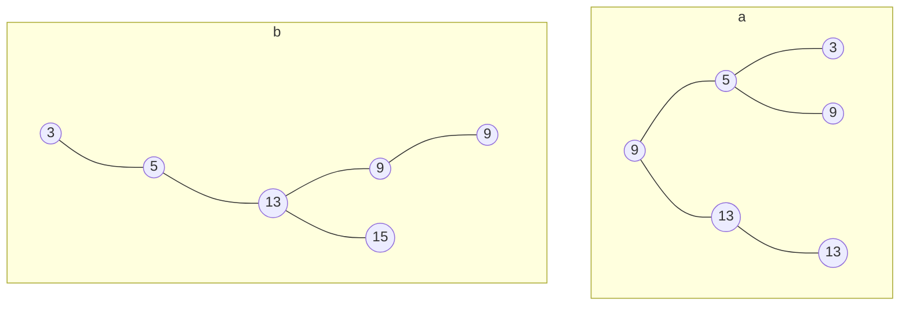

# Arbres binaires de recherche (ABR)

---

**Définition** Un ABR est un arbre binaire tel que pour tout nœud `x` :
  - si `y` est un nœud du sous-arbre gauche de `x` alors `y.cle <= x.cle`
  - si `y` est un nœud du sous-arbre droite de `x` alors `y.cle >= x.cle`

---

**Exemple** L'ensemble de clés `{3, 5, 9, 9, 13, 15}` peut être stocké dans un ABR de plusieurs façons différentes. En voici deux :

## Parcours dans l'ordre des clés

Quel parcours permet de visiter les clés dans l'ordre ? Quelle est sa complexité ?
