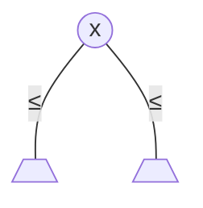
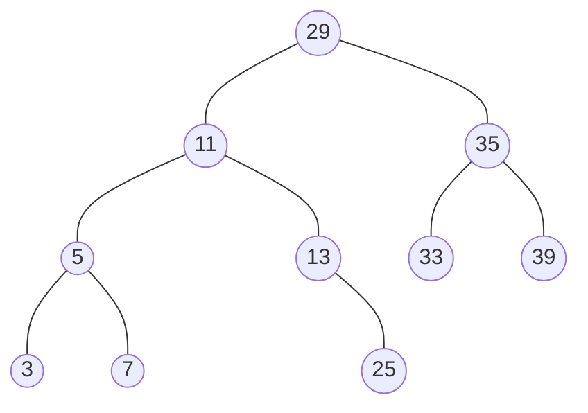
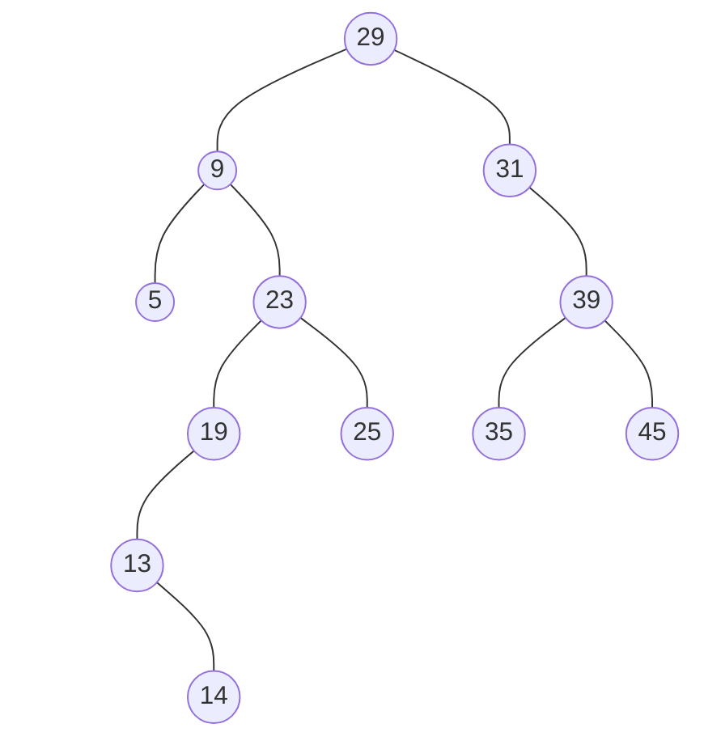

# Arbres binaires de recherche (ABR)

---

**Définition** Un ABR est un arbre binaire tel que pour tout nœud `x` :
  - si `y` est un nœud du sous-arbre gauche de `x` alors `y.cle <= x.cle`
  - si `y` est un nœud du sous-arbre droite de `x` alors `y.cle >= x.cle`



---

**Exemple** L'ensemble de clés `{3, 5, 9, 9, 13, 15}` peut être stocké dans un ABR de plusieurs façons différentes. En voici deux :


## Parcours dans l'ordre des clés

Quel parcours permet de visiter les clés dans l'ordre ? Quelle est sa complexité ?

## Recherche d'une clé

---

**Exercice** Rechercher 25 et 8 dans l'arbre suivant



---

**Version récursive**

```java
// renvoie le nœud du sous-arbre de racine x qui contient k
// ou null si k n'est pas dans cet sous-arbre
Noeud rechercher(Noeud x, cle k) {
  if (x == null || x.cle == k) {
    return x;
  }
  if (k < x.cle) {
    return rechercher(x.gauche, k);
  } else {
    return rechercher(x.droit, k);
  }
}
```

**Version itérative**

```java
Noeud rechercher(cle k) {
  x = racine;
  while (x != null && x.cle != k) {
    x = k < x.cle ? x.gauche : x.droit;
  }
}
```

**Analyse de complexité**

Au pire on effectue une descente de la racine à une feuille au dernier niveau de l'arbre. La complexité est donc $`O(h)`$. Si on veut exprimer cela en fonction du nombre de nœuds $`n`$, rappelons-nous que la hauteur est entre $`\log n`$ est $`n`$. Donc au pire des cas on est à $`\Theta(n)`$.


## Minimum et maximum

```java
// renvoie le nœud qui contient la clé min dans le sous-arbre de racine x
// on suppose que x n'est pas null
Noeud minimum(Noeud x) {
  while (x.gauche != null) x = x.gauche;
  return x;
}
```

**Complexité :** $`O(h)`$


## Successeur et prédécesseur (dans l'ordre des clés)

**Exercice** Trouver les successeurs de 29, 25, et 39 dans l'arbre


```java
// renvoie le noœud qui contient la clé qui suit x.cle dans l'ordre des clés
// ou null si x.cle est la plus grande clé
// on suppose que x n'est pas null
Noeud successeur(Noeud x) {
  if (x.droit != null) return minimum(x.droit);
  y = x.pere;
  while (y != null && x = y.droit) {
    x = y;
    y = y.pere;
  }
  return y;
}
```

**Complexité :** $`O(h)`$


## Ajout d'une clé

---

**Exercice** En partant d'un arbre vide, ajouter les clés 23, 35, 9, 37, 29, 3, 17, 33, 25 dans cet ordre.

---

```java
// ajoute z.cle dans l'arbre en préservant la propriété des ABR
ajouter(Noeud z) {
  y = null;
  x = racine;
  while (x != null) {
    y = x;
    x = z.cle < x.cle ? x.gauche : x.droit;
  }
  z.pere = y;
  if (y == null) { // arbre vide
    racine = z;
  } else {
    if (z.cle < y.cle)
      y.gauche = z;
    else
      y.droit = z;
  }
  z.gauche = z.droit = null;
}
```

**Complexité :** $`O(h)`$


## Suppression

Trois cas possibles : le nœud à supprimer a 0, 1 ou 2 fils.

---

**Exercice** Supprimer 25, 31, et 9 de l'arbre suivant :



---

```java
// supprime z.cle de l'arbre en préservant la propriété des ABR
supprimer(Noeud z) {
  if (z.gauche == null || z.droit == null)
    y = z;
  else
    y = successeur(z);
  // y est le nœud à détacher

  if (y.gauche != null)
    x = y.gauche;
  else
    x = y.droit;
  // x est le fils unique de y ou null si y n'a pas de fils

  if (x != null) x.pere = y.pere;

  if (y.pere == null) { // suppression de la racine
    racine = x;
  } else {
    if (y == y.pere.gauche)
      y.pere.gauche = x;
    else
      y.pere.droite = x;
  }

  if (y != z) z.cle = y.cle;
  recycler y;
}
```

**Complexité :** $`O(h)`$


**Conclusion :** Toutes les opérations s'effectuent en $`O(h)`$. Nous avons donc intérêt de maintenir l'arbre pas trop haut ($`h = \Theta(\log n)`$ et pas $`\Theta(n)`$).


## Comparaison avec des structures linéaires

| Structure     | Recherche     | Ajout   | Suppression |
| ------------- |:-------------:|:-------:|:-----------:|
| tableau trié  | $`O(\log n)`$ |$`O(n)`$ |$`O(n)`$     |
| liste chaînée | $`O(n)`$      |$`O(1)`$ |$`O(1)`$     |
| ABR           | $`O(h)`$      |$`O(h)`$ |$`O(h)`$     |
