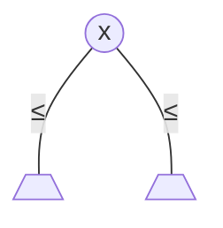
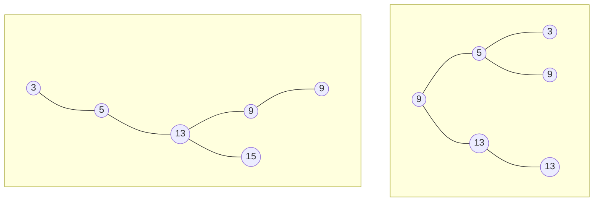
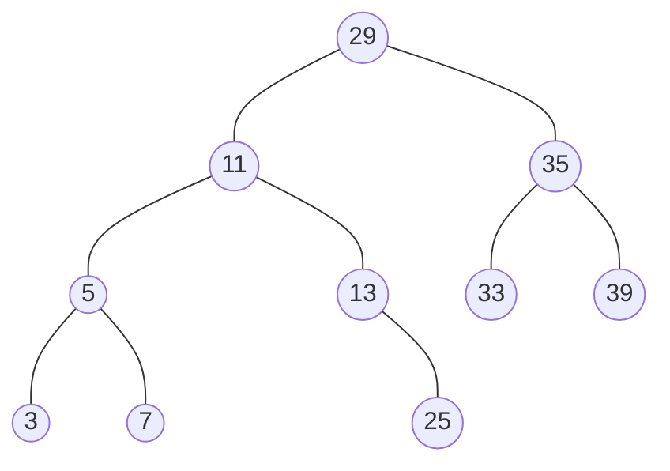

# Arbres binaires de recherche (ABR)

---

**Définition** Un ABR est un arbre binaire tel que pour tout nœud `x` :
  - si `y` est un nœud du sous-arbre gauche de `x` alors `y.cle <= x.cle`
  - si `y` est un nœud du sous-arbre droite de `x` alors `y.cle >= x.cle`



---

**Exemple** L'ensemble de clés `{3, 5, 9, 9, 13, 15}` peut être stocké dans un ABR de plusieurs façons différentes. En voici deux :



## Parcours dans l'ordre des clés

Quel parcours permet de visiter les clés dans l'ordre ? Quelle est sa complexité ?

## Recherche d'une clé

---

**Exercice** Rechercher 25 et 8 dans l'arbre suivant



---

**Version récursive**

```java
Noeud rechercher(Noeud x, cle k) {
  if (x == null || x.cle == k) {
    return x;
  }
  if (k < x.cle) {
    return rechercher(x.gauche, k);
  } else {
    return rechercher(x.droit, k);
  }
}
```

**Version itérative**

```java
Noeud rechercher(cle k) {
  x = racine;
  while (x != null && x.cle != k) {
    x = k < x.cle ? x.gauche : x.droit;
  }
}
```

**Analyse de complexité**

Au pire on effectue une descente de la racine à une feuille au dernier niveau de l'arbre. La complexité est donc $`O(h)`$. Si on veut exprimer cela en fonction du nombre de nœuds $`n`$, rappelons-nous que la hauteur est entre $`\log n`$ est $`n`$. Donc au pire des cas on est à $`O(n)`$.


## Minimum et maximum

```java
Noeus minimum(Noeud x) {
  while (x.gauche != null) x = x.gauche;
  return x;
}
```

**Complexité :** $`O(h)`$


## Successeur et prédécesseur (dans l'ordre des clés)

**Exercice** Trouver les successeurs de 29, 25, et 39 dans l'arbre


```java
Noeud successeur(Noeud x) {
  if (x.droit != null) return minimum(x.droit);
  y = x.pere;
  while (y != null && x = y.droit) {
    x = y;
    y = y.pere;
  }
}
```

**Complexité :** $`O(h)`$


## Ajout d'une clé

---

**Exercice** En partant d'un arbre vide, ajouter les clés 23, 35, 9, 37, 29, 3, 17, 33, 25 dans cet ordre.

---

```java
ajouter(Noeud z) {
  y = null;
  x = racine;
  while (x != null) {
    y = x;
    x = z.cle < x.cle ? x.gauche : x.droit;
  }
  z.pere = y;
  if (y == null) { // arbre vide
    racine = z;
  } else {
    if (z.cle < y.cle) y.gauche = z;
    else y.droit = z;
  }
  z.gauche = z.droit = null;
}
```

**Complexité :** $`O(h)`$
