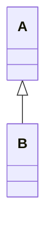
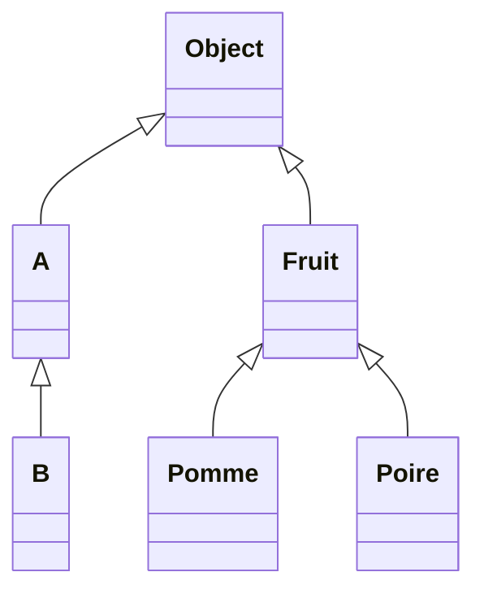

# Rappels de Java et comparaisons avec C++

Caractéristiques :
  * orienté objet (OO)
  * universel (general purpose)
  * propriétaire mais à licence libre
  * machine virtuelle
  * syntaxe proche de C++
  * bibliothèque standard (E/S, structures de données, IHM etc.)
  * pas de pointeurs
  * pas d'héritage multiple (mais interfaces)
  * généricité

## Compilateur et machine virtuelle

```
javac Toto.java -> Toto.class (bytecode)
java Toto -> lancement de la VM
```

Contrairement à C++, pas d'édition de liens et pas d'exécutable natif.
  * plus de portabilité
  * moins d'efficacité (mais JIT)
  * il faut une machine virtuelle

## Variables

  * variables d'instance (champs, attributs)
  * variables de classe (`static`)
  * variables locales

### Types de base

  * `byte` (1 octet), `short` (2 octets), `int` (4 octets), `long` (8 octets)
  * `float` (4 octets) et `double` (8 octets) : arithmétique virgule flottante IEEE 754
  * `char` (2 octets)
  * `boolean`

### Références (tableaux, classes, interfaces)

Qu’affiche le code suivant ?

```java
int x, y;
x = 2;
y = x;
y++;
System.out.println(x + " " + y);
```

Maintenant la même chose mais avec références :

```java
class MonInt {
  int val;

  MonInt(int val) {
    this.val = val;
  }

  int get() {
    return val;
  }

  void inc() {
    val++;
  }
}
...
MonInt mx, my;
mx = new MonInt(2);
my = mx;
my.inc();
System.out.println(mx.get() + " " + my.get());
```

**Rappel :** toutes les références en Java résident dans le *tas*.

Qu'en est-il du code équivalent en C++ ?

```cpp
MonInt mx(2), my;
my = mx;
my.inc();
cout << mx.get() << " " << my.get() << endl;
```

### Visibilité

  * `private` - dans la classe
  * par défaut - dans le package
  * `protected` - dans le package et les sous-classes
  * `public` - partout

## Le cycle de vie des objets

### Création

```java
MonInt mx; // contrairement à C++, pas d'objet crée
MonInt my = new MonInt(2); // création d'objet dans le *tas*
```

### Utilisation

```java
mx.inc(); // Erreur
my.inc(); // OK
```

### Recyclage

  * pas d'opérateur `delete`
  * recyclage automatique (Garbage Collector)

Sans GC on se retrouverait très rapidement avec un tas saturé :

```java
for (int i = 0; i < 1_000_000_000; i++) {
  GrosObjet go = new GrosObjet();
  ...
}
```

Comment détecter si la mémoire occupé par un objet peut être libéré ?

**Approche 1** Recycler à la fin de la portée :

```java
{
  ...
  Truc a = new Truc();
  ...
  // Fin de la portée de a
  // Peut-on recycler la mémoire ?
}
```

**Approche 2** Maintenir un compteur des références actives pour chaque objet. Recycler lorsque ce compteur tombe à zéro. Est-ce que cela marche ?

Le travail de GC est complexe et coûte cher. Parfois des petits « gestes écolo » peuvent l'aider :

```java
{
  GrosObjet go = new GrosObjet();
  ...
  // je n'ai plus besoin de go mas GC ne peut pas récupérer la mémoire
  go = null;
  // maintenant il peut
  ...
}
```

#### Méthode `finalize()` (deprecated)

```java
class Object {
  protected void finalize() {}
}
```
Cette méthode est appelée par GC quand il décide de recycler la mémoire occupée par un objet. Les classes peuvent la surcharger.

**Exemple**

```java
public class MonInt {
  private static int nbObjets = 0;

  private int val;

  public MonInt() {
    this(0);
  }

  public MonInt(int val) {
    nbObjets++;
    this.val = val;
  }

  protected void finalize() {
    nbObjets--;
  }

  public int get() {
    return val;
  }

  public static void main(String[] args) {
    int s = 0;
    for (int i = 0; i < 20_000_000; i++) {
      MonInt mx = new MonInt(i);
      s += mx.get();
      if (i % 1000 == 0) System.out.println(i + " " + MonInt.nbObjets);
    }
  }
}
```


Le GC se déclenche périodiquement afin de libérer de la mémoire. Il est possible de le déclencher explicitement : `System.gc();`

## Variables / méthodes de classe et d'instance

```java
class Toto {
  int x;
  static int sx;

  void m() {
    x = 3; // OK
    sx = 3; // OK
  }

  static void sm() {
    x = 3; // ERREUR
    sx = 3; // OK
  }
}

// À l'extérieur de la classe
Toto t = new Toto();
t.m(); // OK
Toto.sm(); // OK
t.sm(); // OK, équivalent à Toto.sm();
Toto.m(); // ERREUR
```

## Héritage

```java
class A { ... }
class B extends A { ... }
```



`A` est classe mère ou super-classe. `B` est classe fille ou sous-classe.

Chaque classe hérite implicitement de la classe `Object` et comme il n'y a pas d'héritage multiple, les classes forment une arborescence.



Relations « être » et « avoir » :
  * être -> sous-classe (La pomme *est* un fruit)
  * avoir -> attribut (La voiture *a* un moteur)

Le sens du mot-clef `final` dépend du contexte :

```java
final class Truc { // cette classe ne peut pas avoir des sous-classes
  final float PI = 3.141592; // cet attribut n'est pas modifiable

  final void machin() { // cette méthode ne peut pas être surchargée
    ...
  }
}
```

**Exemple**

```java
class Employe {
  private String nom;
  private float salaire;

  public Employe(String nom, float salaire) {
    this.nom = nom;
    this.salaire = salaire;
  }

  public float prime() {
    return 1.5 * salaire;
  }
}


class Secretaire extends Employe {
  private int nbLangues;

  public Secretaire(String nom, float salaire, int nbLangues) {
    // this.nom = nom; <- problème !!!
    super(nom, salaire);
    this.nbLangues = nbLangues;
  }
}


class Directeur extends Employe { // Le directeur *est* un employé
  private Secretaire secretaire; // Il *a* un.e secrétaire

  public Directeur(String nom, float salaire, Secretaire secretaire) {
    super(nom, salaire);
    this.secretaire = secretaire;
  }

  // Le directeur touche 2 fois la prime d'un employé de base
  public prime() {
    // return 3 * salire; <- problème
    return 2 * super.prime();
  }

  public Secretaire getSecretaire() {
    return secretaire;
  }
}
```

```java
Directeur boss = new Employe("Big Boss", 4000); // ERREUR

Employe boss = new Directeur("Big Boss", 4000, new Secretaire("Selina Kyle", 2500, 3)); // OK
float p = boss.prime(); // 12000 (toujours typage dynamique)
Secretaire s = boss.getSecretaire(); // ERREUR
```


#### Polymorphisme

```java
Employe[] personnel = new Employe[3];
personnel[0] = new Employe("Alice", 1000);
personnel[1] = new Secretaire("Bob", 2000, 2);
personnel[2] = new Directeur("Charlie", 3000, personnel[1]);

float primeTotale = 0;
for (Employe e : personnel) primeTotale += e.prime();
```
