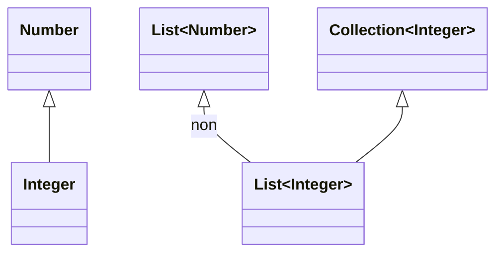
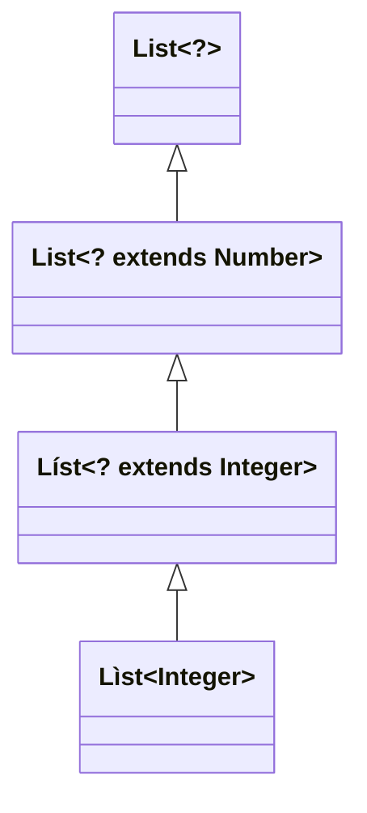

# Rappels de Java 2

## Classes abstraites

  * permettent de partager du code entre des classes étroitement liées
  * implémentent une partie des fonctionnalités et délèguent une partie aux sous-classes

```java
abstract class Horloge {
  private int heure, minute;

  public Horloge(int heure, int minute) {
    this.heure = (heure + minute / 60) % 24;
    this.minute = minute % 60;
  }

  public int getHeure() {
    return heure;
  }

  public int getMinute() {
    return minute;
  }

  public void tick() {
    if (++minute == 60) {
      minute = 0;
      heure = (heure + 1) % 24;
    }
  }

  public abstract void dessiner();
}


class HorlogeAnalogique extends Horloge {
  public HorlogeAnalogique(int heure, int minute) {
    super(heure, minute);
  }

  public void dessiner() {
    ...
  }
}

class HorlogeNumerique extends Horloge {
  ...
}
```

```java
Horloge h = new Horloge(10, 15); // ERREUR

List<Horloge> horloges = new ArrayList<Horloge>();
horloges.add(new HorlogeAnalogique(12, 15));
horloges.add(new HorlogeNumerique(18, 15));
...
for (Horloge h : horloges) h.dessiner();
```

## Interfaces

```java
abstract class Audible {
  public void ecouter();
}

class HorlogeAudible extends Horloge, Audible { // Pas d'héritage multiple
  ...
}
```

```java
interface Audible {
  void ecouter();
}

class HorlogeAudible extends Horloge implements Audible {
  ...

  public void dessiner() {
    ...
  }

  public void ecouter() {
    ...
  }
}
```

*Java < 8 :*
  * classes purement abstraites
  * pas d'attributs
  * pas de constructeurs
  * toutes les méthodes sont publiques

```java
interface Mobile {
  void marcher();
  void voler();
}
```

*Problème :* Les interfaces ne peuvent pas évoluer facilement.

*Solution :* À partir de Java 8 on peut avoir des implémentations

```java
interface Mobile {
  void marcher();
  void voler();
  default void nager() {
    System.out.println("Au secours !");
  }
}
```

Toujours polymorphisme :

```java
List<Audible> audibles = new ArrayList<>();
audibles.add(new HorlogeAudible(18, 40));
audibles.add(new Chanson("Daft Punk", "Technologic"));
...
for (Audible a : audibles) a.ecouter();
```


## Généricité

### Sans généricité (avant Java 1.4)

```java
class Paire {
  private Object a, b;

  public Paire(Object a, Object b) {
    this.a = a;
    this.b = b;
  }

  public Object getA() {
    return a;
  }

  public void setA(Object a) {
    this.a = a;
  }

  public Object getB() {
    return b;
  }

  public void setB(Object b) {
    this.b = b;
  }
}
...

Paire p = new Paire("toto", new Integer(12));
int i = ((Integer)(p.getB())).intValue();
String s = (String)(p.getB()); // ClassCastException (exécution)
```

### Avec généricité (à partir de Java 1.4)

```java
class Paire<A, B> {
  private A a;
  private B b;

  public Paire(A a, B b) {
    this.a = a;
    this.b = b;
  }

  public A getA() {
    return a;
  }

  public void setA(A a) {
    this.a = a;
  }

  public B getB() {
    return b;
  }

  public void setB(B b) {
    this.b = b;
  }
}
...

Paire<String, Integer> p = new Paire<>("toto", 12);
//               |                  |          |
//               V                  V          V
//         pas de types        inférence     boxing
//          primitifs           de type
int i = p.getB(); // unboxing
String s = p.getB(); // ERREUR (compilation)
```

Java vs C++
  * En Java le même bytecode quel que soit le paramètre de type, sucre syntaxique
  * En C++ code objet différent pour chaque paramètre de type, types primitifs possibles en paramètre

### Généricité et héritage



```java
List<Integer> li = ...;
List<Number> ln = li; // ERREUR

...
double somme(List<Number> l) { ... }
...

s = somme(ln); // OK
s = somme(li); // ERREUR

```

#### Jokers

`<? extends E>` - `E` et toutes ses sous-classes (`<?>  <=> <? extends Object>`)



```java
double somme(List<? extends Number> l) { ... }
...

s = somme(ln); // OK
s = somme(li); // OK
```

`<? super E>` - `E` et toutes ses super-classes

```mermaid
classDiagram
  Fruit <|- Pomme
```

```java
void ajouterPomme(List<Pomme> l, Pomme p) { ... }
...

List<Fruit> lf = ...;
List<Pomme> lp = ...;
Pomme p = ...;

ajouterPomme(lp, p); // OK
ajouterPomme(lf, p); // ERREUR
```

```java
void ajouterPomme(List<? super Pomme> l, Pomme p) { ... }
...

List<Fruit> lf = ...;
List<Pomme> lp = ...;
Pomme p = ...;

ajouterPomme(lp, p); // OK
ajouterPomme(lf, p); // OK
```
