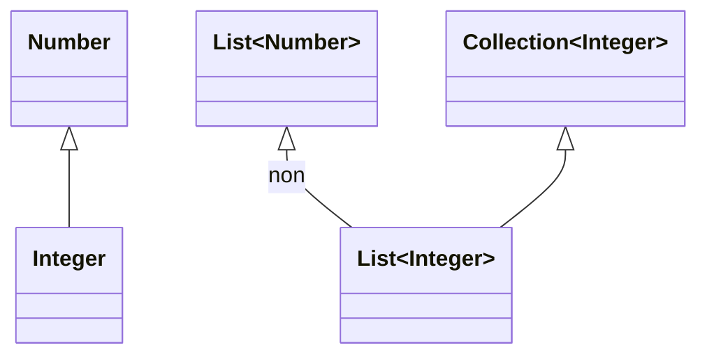
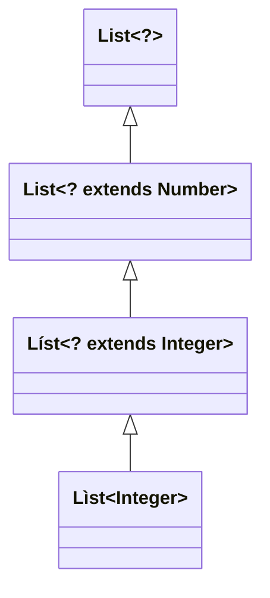
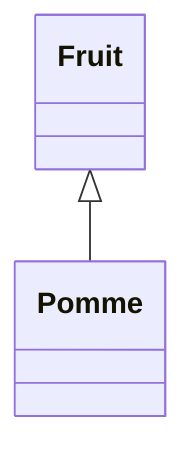

# Rappels de Java 2

## Classes abstraites

  * permettent de partager du code entre des classes étroitement liées
  * implémentent une partie des fonctionnalités et délèguent une partie aux sous-classes

```java
abstract class Horloge {
  private int heure, minute;

  public Horloge(int heure, int minute) {
    this.heure = (heure + minute / 60) % 24;
    this.minute = minute % 60;
  }

  public int getHeure() {
    return heure;
  }

  public int getMinute() {
    return minute;
  }

  public void tick() {
    if (++minute == 60) {
      minute = 0;
      heure = (heure + 1) % 24;
    }
  }

  public abstract void dessiner();
}


class HorlogeAnalogique extends Horloge {
  public HorlogeAnalogique(int heure, int minute) {
    super(heure, minute);
  }

  public void dessiner() {
    ...
  }
}

class HorlogeNumerique extends Horloge {
  ...
}
```

```java
Horloge h = new Horloge(10, 15); // ERREUR

List<Horloge> horloges = new ArrayList<>();
horloges.add(new HorlogeAnalogique(12, 15));
horloges.add(new HorlogeNumerique(18, 15));
...
for (Horloge h : horloges) h.dessiner();
```

## Interfaces

```java
abstract class Audible {
  public void ecouter();
}

class HorlogeAudible extends Horloge, Audible { // Pas d'héritage multiple
  ...
}
```

```java
interface Audible {
  void ecouter();
}

class HorlogeAudible extends Horloge implements Audible {
  ...

  public void dessiner() {
    ...
  }

  public void ecouter() {
    ...
  }
}
```

*Java < 8 :*
  * classes purement abstraites
  * pas d'attributs
  * pas de constructeurs
  * toutes les méthodes sont publiques

```java
interface Mobile {
  void marcher();
  void voler();
}
```

*Problème :* Les interfaces ne peuvent pas évoluer facilement.

*Solution :* À partir de Java 8 on peut avoir des implémentations

```java
interface Mobile {
  void marcher();
  void voler();
  default void nager() {
    System.out.println("Au secours !");
  }
}
```

Toujours polymorphisme :

```java
List<Audible> audibles = new ArrayList<>();
audibles.add(new HorlogeAudible(18, 40));
audibles.add(new Chanson("Daft Punk", "Technologic"));
...
for (Audible a : audibles) a.ecouter();
```


## Généricité

### Sans généricité (avant Java 1.4)

```java
class Paire {
  private Object a, b;

  public Paire(Object a, Object b) {
    this.a = a;
    this.b = b;
  }

  public Object getA() {
    return a;
  }

  public void setA(Object a) {
    this.a = a;
  }

  public Object getB() {
    return b;
  }

  public void setB(Object b) {
    this.b = b;
  }
}
...

Paire p = new Paire("toto", new Integer(12));
int i = ((Integer)(p.getB())).intValue();
String s = (String)(p.getB()); // ClassCastException (exécution)
```

### Avec généricité (à partir de Java 1.4)

```java
class Paire<A, B> {
  private A a;
  private B b;

  public Paire(A a, B b) {
    this.a = a;
    this.b = b;
  }

  public A getA() {
    return a;
  }

  public void setA(A a) {
    this.a = a;
  }

  public B getB() {
    return b;
  }

  public void setB(B b) {
    this.b = b;
  }
}
...

Paire<String, Integer> p = new Paire<>("toto", 12);
//               |                  |          |
//               V                  V          V
//         pas de types        inférence     boxing
//          primitifs           de type
int i = p.getB(); // unboxing
String s = p.getB(); // ERREUR (compilation)
```

Java vs C++
  * En Java le même bytecode quel que soit le paramètre de type, sucre syntaxique
  * En C++ code objet différent pour chaque paramètre de type, types primitifs possibles en paramètre

### Généricité et héritage



```java
List<Integer> li = ...;
List<Number> ln = li; // ERREUR

...
double somme(List<Number> l) { ... }
...

s = somme(ln); // OK
s = somme(li); // ERREUR

```

#### Jokers

`<? extends E>` - `E` et toutes ses sous-classes (`<?>  <=> <? extends Object>`)



```java
double somme(List<? extends Number> l) { ... }
...

s = somme(ln); // OK
s = somme(li); // OK
```

`<? super E>` - `E` et toutes ses super-classes



```java
void ajouterPomme(List<Pomme> l, Pomme p) { ... }
...

List<Fruit> lf = ...;
List<Pomme> lp = ...;
Pomme p = ...;

ajouterPomme(lp, p); // OK
ajouterPomme(lf, p); // ERREUR
```

```java
void ajouterPomme(List<? super Pomme> l, Pomme p) { ... }
...

List<Fruit> lf = ...;
List<Pomme> lp = ...;
Pomme p = ...;

ajouterPomme(lp, p); // OK
ajouterPomme(lf, p); // OK
```

### Méthodes génériques

```java
class Util {
  public static <T> void ajouterElement(List<? super T> l, T t) { ... }
}
```

## Expressions lambda

```java
void afficherEmployesPlusAgesQue(List<Employe> personnel, int age) {
  for (Employe e : personnel) {
    if (e.getAge() > age) {
      System.out.println(e.getNom());
    }
  }
}
```

  * Tous les employés entre `age1` et `age2` ?
  * Toutes les femmes plus jeunes que `age` ?

Une méthode plus générale :

```java
interface Testeur {
  boolean test(Employe e);
}
...

void afficherEmployes(List<Employe> personnel, Testeur testeur) {
  for (Employe e : personnel) {
    if (testeur.test(e)) {
      System.out.println(e.getNom());
    }
  }
}
```

Avec une classe :

```java
class TesteurAge implements Testeur {
  private int age;

  public Testeur(int age) {
    this.age = age;
  }

  public boolean test(Employe e) {
    return e.getAge() > age;
  }
}
...

afficherEmployes(personnel, new TesteurAge(30));
```

Avec une classe anonyme :

```java
afficherEmployes(personnel,
  new Testeur() {
    public boolean test(Employer e) {
      return e.getAge() > 30;
    }
  }
);
```

Avec une expression lambda :

```java
afficherEmployes(personnel, e -> e.getAge() > 30);
```

Les expressions lambda sont des implémentations d'interfaces fonctionnelles : interfaces avec une seule méthode abstraite (*Single Abstract Method, SAM*).

Syntaxe :

```
(param1, param2, ..., param n) -> corps
```

  * On peut omettre le type des paramètres
  * On peut omettre les parenthèses si un seul paramètre
  * Le corps est une expression ou un bloc
  * On peut utiliser `::` (références de méthodes)
    * `e -> e.getAge() <=> Employe::getAge`
    * `e -> System.out.println(e) <=> System.out::println`

Interfaces fonctionnelles standards [java.util.function](https://docs.oracle.com/en/java/javase/17/docs/api/java.base/java/util/function/package-summary.html)

```java
interface Predicate<T>  {
  boolean test(T t);
}

interface Consumer<T> {
  void accept(T t);
}

interface Function<T, R> {
  R apply(T t);
}

interface UnaryOperator<T> extends Function<T, T>;

interface Supplier<T> {
  T get();
}

...
```

```java
void afficherEmployes(List<Employe> personnel, Predicate<Employer> testeur) {
  for (Employe e : personnel) {
    if (testeur.test(e)) {
      System.out.println(e.getNom());
    }
  }
}
```

Ou une méthode encore plus générale :

```java
void traiterEmployes(List<Employe> personnel, Predicate<Employe> testeur, Consumer<Employe> traitement) {
  for (Employe e : personnel) {
    if (testeur.test(e)) traitement.accept(e);
  }
}
...

traiterEmployes(personnel, e -> e.getAge() < 40 && e.getSexe() == M, e -> System.out.println(e.getNom()));
traiterEmployes(personnel, e -> e.getSexe() == F, e -> e.setSalaire(1.2 * e.getSalaire()));
```

... et même générique :

```java
<T> void traiterElements(Iterable<T> elements, Predicate<? super T> testeur, Consumer<? super T> traitement) {
  for (T e : elements) {
    if (testeur.test(e)) traitement.accept(e);
  }
}
```

## Streams

Motivation : parallélisme. L'itération externe (itérateurs) ne peut être que séquentielle.

```java
personnel.stream().filter(e -> e.getAge() > 40).map(Employe::getNom).forEach(System.out::println);

double ageMoyenF = personnel.stream().filter(e -> e.getSexe() == F)
  .mapToInt(Employe::getAge).average().getAsDouble();
```

Les streams ne remplacent pas les collections.
  * Les collections stockent les données
  * Les streams font passer les données par des pipelines

Pipeline :
  * Source
  * Opérations intermédiaires
  * Opération terminale

Sources :

```java
// Collections
Stream<Employe> s = presonnel.stream();

// Tableaux
Animal[] zoo = ...;
Stream<Animal> s = Arrays.stream(zoo);

// Canaux E/S
Stream<String> s = Files.lines(Path.of("monfichier.txt"));

// Générateurs
IntStream s = IntStream.range(0, 100);

Random rnd = new Random();
IntStream s = IntStream.generate(r::nextInt);
```

Opérations intermédiaires (`Stream -> Stream`) :

```java
interface Stream<T> {
  Stream<T> distinct();
  Stream<T> filter(Predicate<? super T> predicate);
  Stream<T> limit(long maxSize);
  <R> Stream<R> map(Function<? super T,? extends R> mapper);
  Stream<T> peek(Consumer<? super T> action);
  Stream<T> skip(long n);
  Stream<T> sorted();
  ...
}
```

Opérations terminales :
  * `forEach()`
  * `reduce()`
  * `count()`, `sum()`, `average()`, `min()`, `max()` ...
  * `collect()` ...

Parallélisme :

```java
personnel.parallelStream().filter(e -> e.getAge() > 40)...
  .sequential()...parallel()... ;
```
