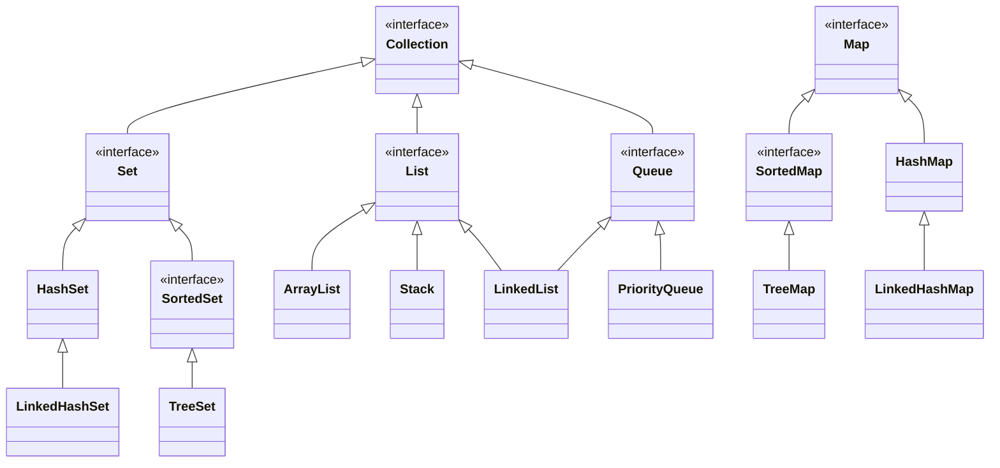

# Java Collection Framework (JCF)

JCF contient :
  * Interfaces
  * Implémentations
  * Algorithmes

Avantages :
  * moins d'efforts
  * plus d'efficacité et de qualité
  * liens plus faciles entre différentes APIs
  * code plus réutilisable



## Interface [`Collection`](https://docs.oracle.com/en/java/javase/17/docs/api/java.base/java/util/Collection.html)

```java
interface Collection<E> {
  // opérations de base
  int size();
  boolean isEmpty();
  boolean contains(Object o);
  boolean add(E e); // facultative
  boolean remove(Object o); // facultative

  // opérations de masse
  boolean containsAll(Collection<?> c);
  boolean addAll(Collection<? extends E> c); // facultative
  boolean removeAll(Collection<?> c); // facultative
  boolean retainAll(); // facultative
  void clear(); // facultative

  // opérations tableaux
  Object[] toArray();
  <T> T toArray(T[] a);

  // itérateur
  Iterator<E> iterator();
}
```

Méthodes facultatives : `UnsupportedOperationException`.

En plus de ces méthodes, chaque implémentation doit contenir un constructeur par défaut et un constructeur par recopie

```java
public class MyCollection<E> implements Collection<E> {
  public MyCollection() {
    // crée une collection vide
  }

  public MyCollection(Collection<? extends E> c) {
    // crée une collection qui contient les mêmes éléments que c
  }
}
```
