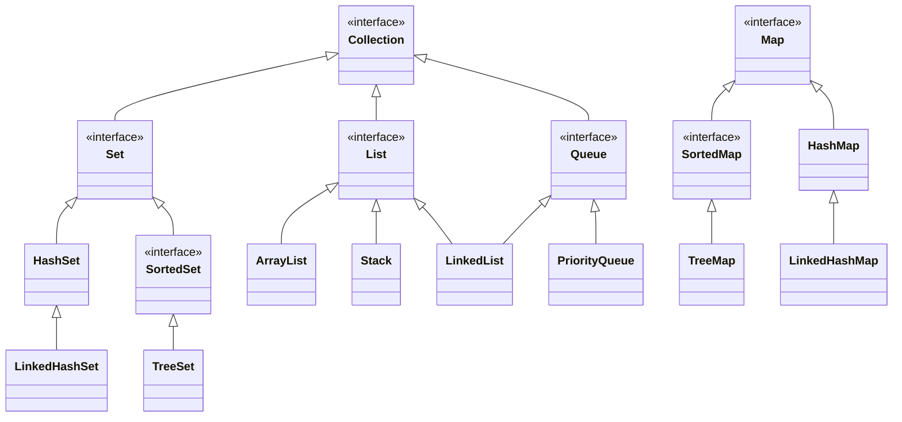

# Java Collection Framework (JCF)

JCF contient :
  * Interfaces
  * Implémentations
  * Algorithmes

Avantages :
  * moins d'efforts
  * plus d'efficacité et de qualité
  * liens plus faciles entre différentes APIs
  * code plus réutilisable



## Interface [`Collection`](https://docs.oracle.com/en/java/javase/17/docs/api/java.base/java/util/Collection.html)

```java
interface Collection<E> {
  // opérations de base
  int size();
  boolean isEmpty();
  boolean contains(Object o);
  boolean add(E e); // facultative
  boolean remove(Object o); // facultative

  // opérations de masse
  boolean containsAll(Collection<?> c);
  boolean addAll(Collection<? extends E> c); // facultative
  boolean removeAll(Collection<?> c); // facultative
  boolean retainAll(); // facultative
  void clear(); // facultative

  // opérations tableaux
  Object[] toArray();
  <T> T toArray(T[] a);

  // itérateur
  Iterator<E> iterator();
}
```

Méthodes facultatives : `UnsupportedOperationException`.

En plus de ces méthodes, chaque implémentation doit contenir un constructeur par défaut et un constructeur par recopie

```java
public class MyCollection<E> implements Collection<E> {
  public MyCollection() {
    // crée une collection vide
  }

  public MyCollection(Collection<? extends E> c) {
    // crée une collection qui contient les mêmes éléments que c
  }
}
```

### Interface [`Iterator`](https://docs.oracle.com/en/java/javase/17/docs/api/java.base/java/util/Iterator.html)

```java
interface Iterator<E> {
  boolean hasNext();
  E next();
  void remove(); // facultative
}
```

Parcour typique d'une collection avec itérateur :
```java
Collection<Truc> trucs = ...;

Iterator<Truc> it = trucs.iterator();
while (it.hasNext()) {
  Truc truc = it.next();
  // traiter truc
}
```

La boucle foreach utilise un itérateur !

```java
for (Truc truc : trucs) {
  // traiter truc
}
```
est juste un raccourci pour la boucle `while` précédente.

Dans certains cas particuliers les implémentations *doivent* déclencher des exceptions.

```java
Iterator<Truc> it = trucs.iterator();
while(it.hasNext()) it.next();
it.next(); // NoSuchElementException
```

`remove()` supprime *l'élément renvoyé par le dernier appel de* `next()`.

```java
Iterator<Truc> it = trucs.iterator();
it.remove(); // IllegalStateException

it = trucs.iterator();
Truc a = it.next();
Truc b = it.next();
it.remove(); // supprime b
it.remove(); // IllegalStateException
```

Extrait de la documentation de `remove()` :

> The behavior of an iterator is unspecified if the underlying collection is modified while the iteration is in progress in any way other than by calling this method, unless an overriding class has specified a concurrent modification policy.

```java
Collection<Animal> animaux = ...;

// À ne JAMAIS faire
Iterator<Animal> it = animaux.iterator();
while (it.hasNext()) {
  Animal animal = it.next();
  if (animal.estPoilu()) animaux.remove(animal);
}

// .. ni la forme équivalente
for (Animal animal : animaux) {
  if (animal.estPoilu()) animaux.remove(animal);
}

// La bonne façon de faire :
Iterator<Animal> it = animaux.iterator();
while(it.hasNext()) {
  Animal animal = it.next();
  if (animal.estPoilu()) it.remove();
}
```

### Implémentation d'une collection *from skratch*

TODO
