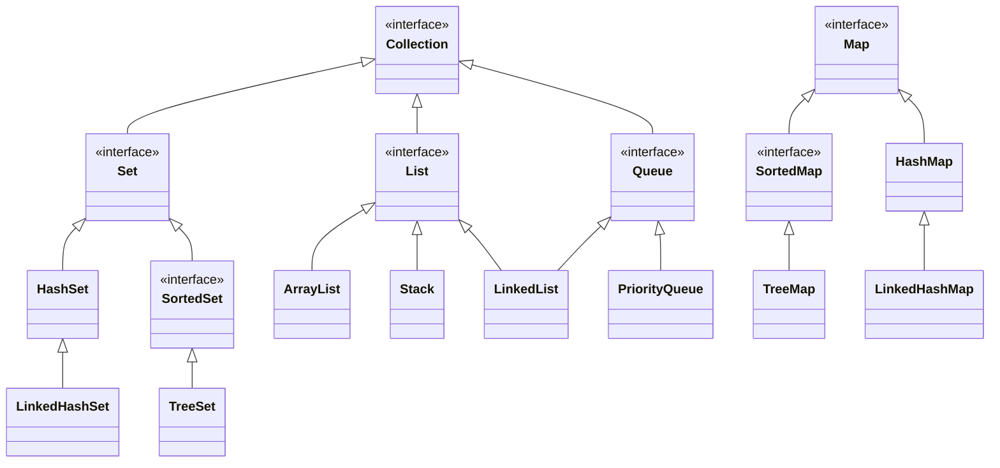

# Java Collection Framework (JCF)

JCF contient :
  * Interfaces
  * Implémentations
  * Algorithmes

Avantages :
  * moins d'efforts
  * plus d'efficacité et de qualité
  * liens plus faciles entre différentes APIs
  * code plus réutilisable



## Interface [`Collection`](https://docs.oracle.com/en/java/javase/17/docs/api/java.base/java/util/Collection.html)

```java
interface Collection<E> {
  // opérations de base
  int size();
  boolean isEmpty();
  boolean contains(Object o);
  boolean add(E e); // facultative
  boolean remove(Object o); // facultative

  // opérations de masse
  boolean containsAll(Collection<?> c);
  boolean addAll(Collection<? extends E> c); // facultative
  boolean removeAll(Collection<?> c); // facultative
  boolean retainAll(Collection<?> c); // facultative
  void clear(); // facultative

  // opérations tableaux
  Object[] toArray();
  <T> T toArray(T[] a);

  // itérateur
  Iterator<E> iterator();
}
```

Méthodes facultatives : `UnsupportedOperationException`.

En plus de ces méthodes, chaque implémentation doit contenir un constructeur par défaut et un constructeur par recopie

```java
public class MyCollection<E> implements Collection<E> {
  public MyCollection() {
    // crée une collection vide
  }

  public MyCollection(Collection<? extends E> c) {
    // crée une collection qui contient les mêmes éléments que c
  }
}
```

### Interface [`Iterator`](https://docs.oracle.com/en/java/javase/17/docs/api/java.base/java/util/Iterator.html)

```java
interface Iterator<E> {
  boolean hasNext();
  E next();
  void remove(); // facultative
}
```

Parcour typique d'une collection avec itérateur :
```java
Collection<Truc> trucs = ...;

Iterator<Truc> it = trucs.iterator();
while (it.hasNext()) {
  Truc truc = it.next();
  // traiter truc
}
```

La boucle foreach utilise un itérateur !

```java
for (Truc truc : trucs) {
  // traiter truc
}
```
est juste un raccourci pour la boucle `while` précédente.

Dans certains cas particuliers les implémentations *doivent* déclencher des exceptions.

```java
Iterator<Truc> it = trucs.iterator();
while(it.hasNext()) it.next();
it.next(); // NoSuchElementException
```

`remove()` supprime *l'élément renvoyé par le dernier appel de* `next()`.

```java
Iterator<Truc> it = trucs.iterator();
it.remove(); // IllegalStateException

it = trucs.iterator();
Truc a = it.next();
Truc b = it.next();
it.remove(); // supprime b
it.remove(); // IllegalStateException
```

Extrait de la documentation de `remove()` :

> The behavior of an iterator is unspecified if the underlying collection is modified while the iteration is in progress in any way other than by calling this method, unless an overriding class has specified a concurrent modification policy.

```java
Collection<Animal> animaux = ...;

// À ne JAMAIS faire
Iterator<Animal> it = animaux.iterator();
while (it.hasNext()) {
  Animal animal = it.next();
  if (animal.estPoilu()) animaux.remove(animal);
}

// .. ni la forme équivalente
for (Animal animal : animaux) {
  if (animal.estPoilu()) animaux.remove(animal);
}

// La bonne façon de faire :
Iterator<Animal> it = animaux.iterator();
while(it.hasNext()) {
  Animal animal = it.next();
  if (animal.estPoilu()) it.remove();
}
```

### Implémentation d'une collection *from skratch*

Une collection qui stocke ses éléments dans un tableau. Implémentation inspirée de `ArrayList`.

Problématique principale : lorsque le tableau est rempli, il faut reallouer et recopier tous les éléments et cela coûte cher. Faire moins de telles opérations mais sans utiliser trop de mémoire.

```java
public class MyCollection<E> implements Collection<E> {
  private static final int INITIAL_CAPACITY = 10;
  private static final int CAPACITY_INCREMENT = 10;

  private E[] elements;
  private int size;

  // Helpers
  private void fastAdd(E e) {
    elements[size++] = e;
  }

  private void fastRemove(int i) {
    System.arraycopy(elements, i + 1, elements, i, size - i - 1);
    elements[--size] = null;
  }

  private int indexOf(Object o) {
    if (o == null) {
      for (int i = 0; i < size; i++) {
        if (elements[i] == null) return i;
      }
    } else {
      for (int i = 0; i < size; i++) {
        if (o.equals(elements[i])) return i;
      }
    }
    return -1;
  }

  private void incrementCapacity(int c) {
    elements = Arrays.copyOf(elements, elements.length + c);
  }

  // Constructors
  public MyCollection(int n) {
    elements = (E[]) new Object[n];
    size = 0;
  }

  public MyCollection() {
    this(INITIAL_CAPACITY);
  }

  public MyCollection(Collection<? extends E> c) {
    this(c.size() + CAPACITY_INCREMENT);
    for (E e : c) fastAdd(e);
  }

  // Simple operations
  public int size() {
    return size;
  }

  public boolean isEmpty() {
    return size == 0;
  }

  public boolean contains(Object o) {
    return indexOf(o) != -1;
  }

  public boolean add(E e) {
    if (size == elements.length) incrementCapacity(CAPACITY_INCREMENT);
    fastAdd(e);
    return true;
  }

  public boolean remove(Object o) {
    int i = indexOf(o);
    if (i != -1) fastRemove(i);
    return i != -1;
  }

  // Bulk operations
  public boolean containsAll(Collection<?> collection) {
    for (Object o : collection) {
      if (!contains(o)) return false;
    }
    return true;
  }

  public boolean addAll(Collection<? extends E> collection) {
    int missing = size + collection.size() - elements.length;
    if (missing > 0) incrementCapacity(missing + CAPACITY_INCREMENT);
    for (E e : collection) fastAdd(e);
    return collection.size() > 0;
  }

  public boolean removeAll(Collection<?> collection) {
    boolean res = false;
    for (Object o : collection) {
      while (remove(o)) res = true;
    }
    return res;
  }

  public boolean retainAll(Collection<?> collection) {
    boolean res = false;
    int i = 0;
    while (i < size) {
      if (!collection.contains(elements[i])) {
        fastRemove(i);
        res = true;
      } else {
        i++;
      }
    }
    return res;
  }

  public void clear() {
    Arrays.fill(elements, 0, size, null);
    size = 0;
  }

  // Iterators
  public Iterator<E> iterator() {
    return new MyIterator();
  }

  private class MyIterator implements Iterator<E> {
    private int iNext = 0;
    private int iPrev = -1;

    public boolean hasNext() {
      return iNext < size;
    }

    public E next() {
      if (iNext >= size) throw new NoSuchElementException();
      iPrev = iNext++;
      return elements[iPrev];
    }

    public void remove() {
      if (iPrev == -1) throw new IllegalStateException();
      fastRemove(iPrev);
      iNext--;
      iPrev = -1;
    }
  }

  // Arrays
  public Object[] toArray() {
    return Arrays.copyOf(elements, size);
  }

  public <T> T[] toArray(T[] ts) {
    if (size <= ts.length) {
      System.arraycopy(elements, 0, ts, 0, size);
    } else {
      ts = (T[]) Arrays.copyOf(elements, size, ts.getClass());
    }
    return ts;
  }
}
```

### Implémentation à partir de [`AbstractCollection`](https://docs.oracle.com/en/java/javase/17/docs/api/java.base/java/util/AbstractCollection.html)

```java
public class MyCollection<E> extends AbstractCollection<E> { ... }
```

Seulement deux méthodes abstraites : `size()` et `iterator()`. Mais pour faire une collection opérationnelle et efficace, il faut surcharger d'autres. Pour savoir lesquelles, lire la documentation.

**Exemple 1** `isEmpty()`

> This implementation returns size() == 0.

**Exemple 2** `add()`

> This implementation always throws an UnsupportedOperationException.

**Exemple 3** `addAll()`

> This implementation iterates over the specified collection, and adds each object returned by the iterator to this collection, in turn.


## Ordre

**Exemple**

```java
List<String> l = new ArrayList<>();
l.add("Charlie"); l.add("Alice"); l.add("Bob");
Collections.sort(l); // ["Alice", "Bob", "Charlie"]
```

Comment ça marche ?

### Ordre naturel

```java
interface Comparable<T> {
  int compareTo(T t);
}
```

La classe `String` implémente `Comparable<String>`.

```java
class Employe implements Comparable<Employe> {
  private String nom;
  private int salaire;

  ...

  public int compareTo(Employe e) {
    return nom.compareTo(e.nom);
  }
}
```

```java
List<Employe> personnel = ...;
...
Collections.sort(personnel); // Trié par ordre alphabétique des noms
```

Mais comment on fait pour trier en ordre décroissant des salaires ?

### Comparateurs

```java
interface Comparator<T> {
  int compare(T t1, T t2);
}
```

```java
Collections.sort(personnel, (e1, e2) -> e2.getSalaire() - e1.getSalaire());
```

Certains collections utilisent l'ordre pour rendre certaines opérations plus efficaces.

```java
SortedSet<Employe> personnel = new TreeSet<>(); // ordre naturel
SortedSet<Employe> personnel = new TreeSet<>((e1, e2) -> e2.getSalaire() - e1.getSalaire());
