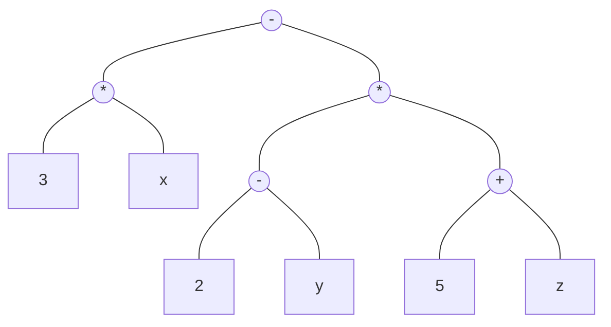

# Arbres

De façon informelle, un arbre est un ensemble de nœuds organisés hiérarchiquement autour d'un nœud central appelé racine. Le terme exact est *arborescence* mais on utilisera arbre par abus de langage.

**Exemple** Système de fichiers

```
/
├── bin
├── boot
│   ├── efi
│   └── grub
├── dev
│   ├── block
│   ├── bus
│   ├── usb
│   └── wmi
├── home
│   └── stefan
└── var
    ├── backups
    ├── cache
    ├── crash
    ├── lib
    ├── local
    └── tmp
```

**Exemple** Représentation d'une expression : $`3x - (2-y)(5 + z)`$


