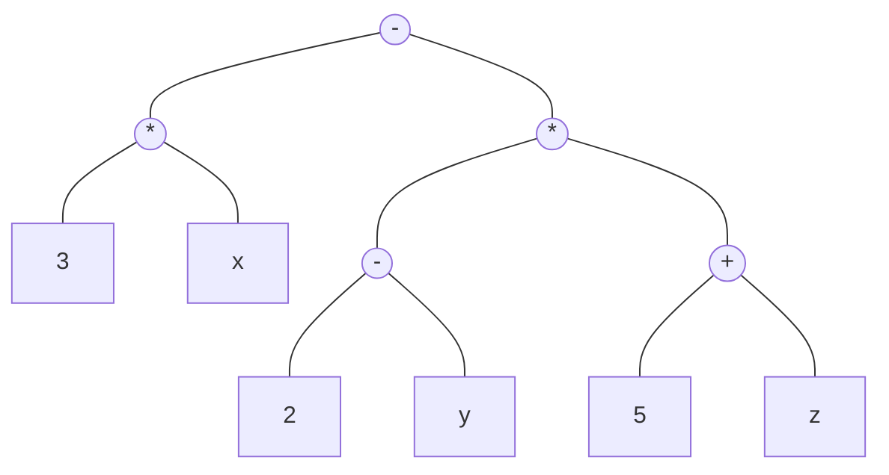
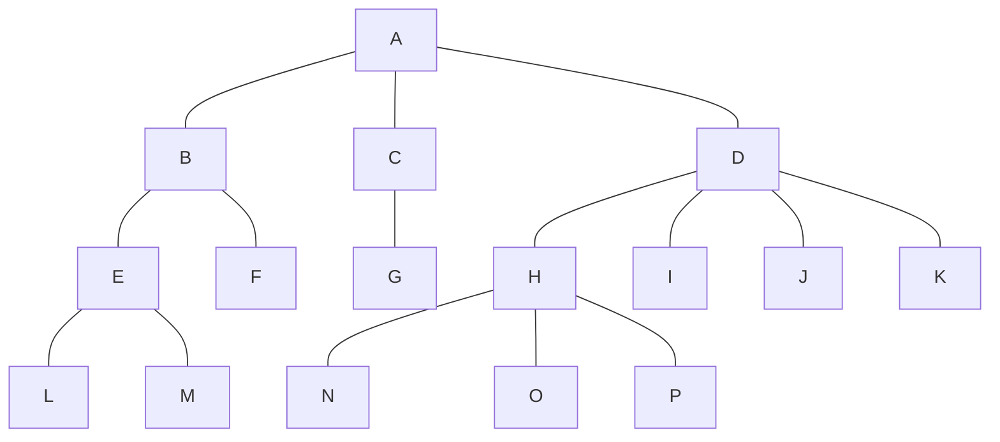
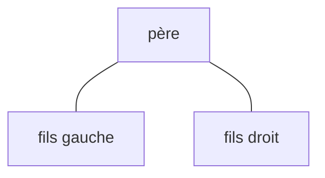
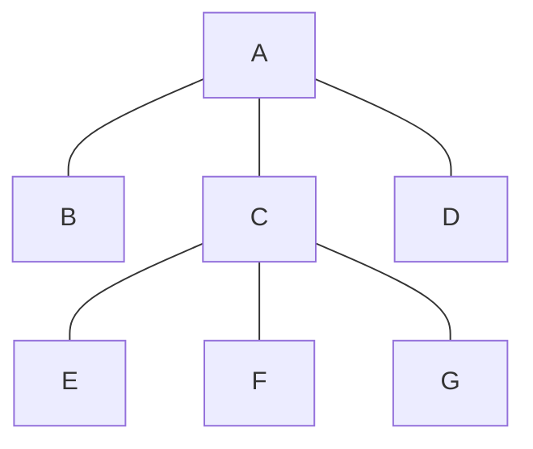
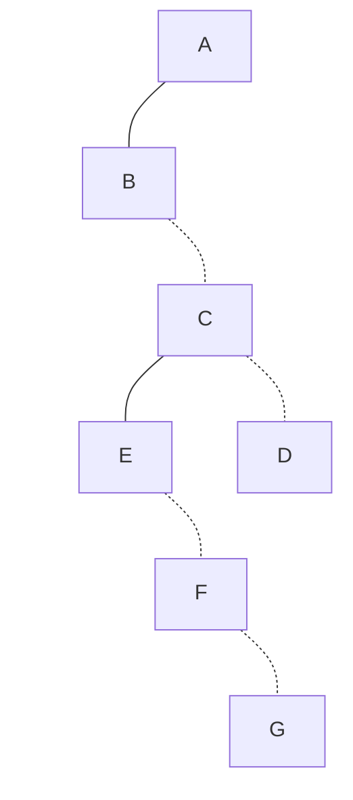
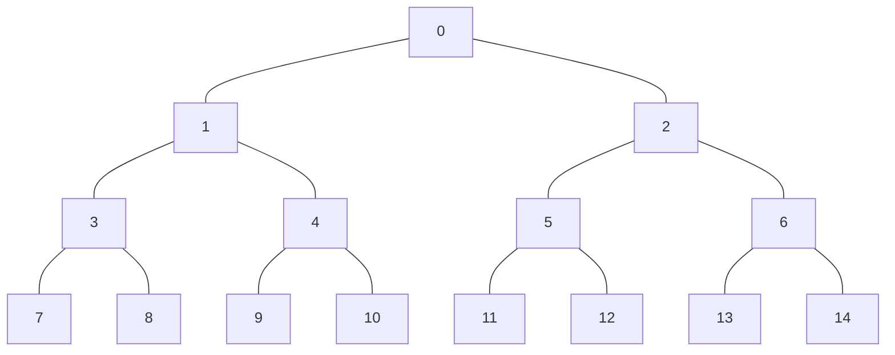

# Arbres

## Quelques définitions

De façon informelle, un arbre est un ensemble de nœuds organisés hiérarchiquement autour d'un nœud central appelé racine. Le terme exact est *arborescence* mais on utilisera arbre par abus de langage.

**Exemple** Système de fichiers

```
/
├── bin
├── boot
│   ├── efi
│   └── grub
├── dev
│   ├── block
│   ├── bus
│   ├── usb
│   └── wmi
├── home
│   └── stefan
└── var
    ├── backups
    ├── cache
    ├── crash
    ├── lib
    ├── local
    └── tmp
```

**Exemple** Représentation d'une expression : $`3x - (2-y)(5 + z)`$



---

**Définition** Un *arbre* est un ensemble fini et non vide de nœuds, tel que :
  - Il existe un nœud appelé *racine*.
  - Le reste des nœuds est partitionné en $`n \ge 0`$ sous-ensembles disjoints $`T_1,\dots,T_n`$ où chaque $`T_i`$ est un arbre. $`T_1,\dots,T_n`$ sont des *sous-arbres* de la racine.  

---


**Remarque** : C'est une définition récursive. Chaque nœud est donc la racine d'un sous-arbre.

---

**Définition** Le *degré* d'un nœud est le nombre des sous-arbres qu'il possède. Le degré de l'arbre est le maximum des degrés de ses nœuds. Un nœud de degré 0 est une *feuille*.

---

**Définition** Un nœud est le *père* des racines de ses sous-arbres qui à leur tour sont ses *fils*. Les fils qui ont le même père sont des *frères*.

Les *ancêtres* d'un nœud sont les nœuds situés sur le chemin de la racine à celui-ci. Les *descendants* d'un nœud sont tous les nœuds de ses sous-arbres.

Par analogie on peut définir d'autres relations de parenté, telles que grand-père, petit fis, oncle, cousin etc.

---

**Définition** Le *niveau* de la racine est 0. Le niveau d'un nœud est le niveau de son père + 1. Le niveau (la *hauteur*) d'un arbre est le maximum des niveaux de ses nœuds.

---

**Exercice**



  * Quelle est la racine de cet arbre ?
  * Quels sont les sous-arbres de B ?
  * Quel est le degré de la racine ? De l'arbre ?
  * Quelles sont les feuilles ?
  * Quels sont les descendants de B ?
  * Quels sont les ancêtres de P ?
  * Quels sont les cousins de H ?
  * Quels sont les oncles de G ?
  * Quels sont les nœuds de niveau 3 ?
  * Quelle est la hauteur de l'arbre ?

## Représentation dans la mémoire

### Avec des listes

```
(racine (sous-arbre 1) ... (sous-arbre n))
```

### Avec pointeurs (représentation chaînée)

Chaque nœud à les champs suivants :
  - donnée
  - pointeur vers le père
  - pointeur vers le premier fils
  - pointeur vers le frère précédent
  - pointeur vers le frère suivant

## Arbres binaires

Les *arbres binaires* sont des arbres de degré inférieur ou égal à 2. Chaque nœud a au plus deux fils :



### Représentation d'un arbre général par un arbre binaire

Le premier fils devient le fils gauche, le frère suivant devient fils droit.

**Exemple** L'arbre



devient



### Arbres binaires particuliers

Un arbre binaire *dégénéré* est un arbre binaire de degré inférieur où égal à 1.

Un arbre binaire *complet* est un arbre dans lequel tous les nœuds sont de degré 2 sauf ceux du dernier niveau.

---

**Exercice**
  - Quel est le nombre de nœuds dans un arbre dégénéré de hauteur $`h`$ ?
  - Quel est le nombre de nœuds dans un arbre complet de hauteur $`h`$ ?

---


### Propriétés des arbres binaires

---

**Proposition**
  - Le nombre maximal de nœuds de niveau $`i`$ est $`2^i`$
  - Le nombre maximal de nœuds d'un arbre de hauteur $`h`$ est $`2^{h + 1} - 1`$

---

**Proposition** Pour un arbre binaire de $`n`$ nœuds et de hauteur $`h`$

```math
\left\lfloor \log_2 n \right\rfloor \le h \le n - 1
```

### Représentation dans la mémoire d'un arbre binaire

#### Avec un tableau



---

**Exercice** Soit $`i`$ l'indice d'un nœud.
  * Quel est l'indice de son fils gauche ?
  * Quel est l'indice de son fils droit ?
  * Quel est l'indice de son père ?

---

#### Représentation chaînée

Chaque nœud a des pointeurs vers son père, son fils gauche et son fils droit.

Soit `x` un nœud. On va noter :
  - `x.cle` : la clé (la donnée) stocké dans `x`
  - `x.pere` : le père de `x` (`null` si `x` est la racine)
  - `x.gauche` : le fils gauche de `x` (`null` si `x` n'a pas de fils gauche)
  - `x.droit` : le fils droit de `x` (`null` si `x` n'a pas de fils droit)
