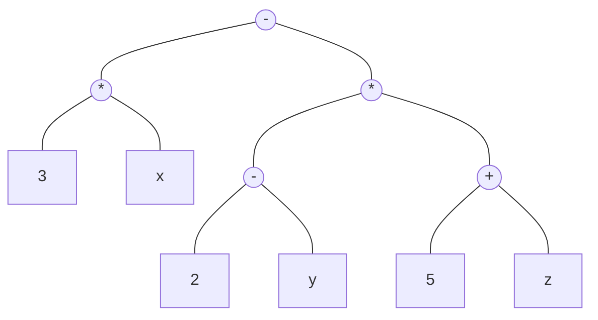

# Arbres

## Quelques définitions

De façon informelle, un arbre est un ensemble de nœuds organisés hiérarchiquement autour d'un nœud central appelé racine. Le terme exact est *arborescence* mais on utilisera arbre par abus de langage.

**Exemple** Système de fichiers

```
/
├── bin
├── boot
│   ├── efi
│   └── grub
├── dev
│   ├── block
│   ├── bus
│   ├── usb
│   └── wmi
├── home
│   └── stefan
└── var
    ├── backups
    ├── cache
    ├── crash
    ├── lib
    ├── local
    └── tmp
```

**Exemple** Représentation d'une expression : $`3x - (2-y)(5 + z)`$



---

**Définition** Un *arbre* est un ensemble fini et non vide de nœuds, tel que :
  - Il existe un nœud appelé *racine*.
  - Le reste des nœuds est partitionné en $`n \ge 0`$ sous-ensembles disjoints $`T_1,\dots,T_n`$ où chaque $`T_i`$ est un arbre. $`T_1,\dots,T_n`$ sont des *sous-arbres* de la racine.  

---


**Remarque** : C'est une définition récursive. Chaque nœud est donc la racine d'un sous-arbre.

---

**Définition** Le *degré* d'un nœud est le nombre des sous-arbres qu'il possède. Le degré de l'arbre est le maximum des degrés de ses nœuds. Un nœud de degré 0 est une *feuille*.

---

**Définition** Un nœud est le *père* des racines de ses sous-arbres qui à leur tour sont ses *fils*. Les fils qui ont le même père sont des *frères*.

Les *ancêtres* d'un nœud sont les nœuds situés sur le chemin de la racine à celui-ci. Les *descendants* d'un nœud sont tous les nœuds de ses sous-arbres.

Par analogie on peut définir d'autres relations de parenté, telles que grand-père, petit fis, oncle, cousin etc.

---

**Définition** Le *niveau* de la racine est 0. Le niveau d'un nœud est le niveau de son père + 1. Le niveau (la *hauteur*) d'un arbre est le maximum des niveaux de ses nœuds.

---
